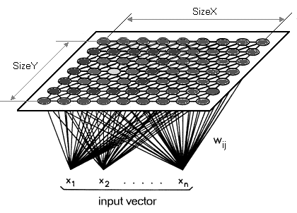

# The Kohonen Network

The Kohonen Self Organising Map (SOM) provides a data visualization technique which helps to understand high dimensional data by reducing the dimensions of data to a map. SOM also represents clustering concept by grouping similar data together.

Unlike other learning technique in neural networks, training a SOM requires no target vector. A SOM learns to classify the training data without any external supervision.




The challenge answers are inline in the kohonen.ipynb file.

To use the code first start with a new python environment.
Use conda, venv or UV.

Conda example:
```
conda create --name 'environment-name' python=3.11

conda activate 'environment-name'
```

Install package requirements.
```
pip install -r requirements.txt
```
Run code.
```
python kohonen.py --iterations 1000 --width 100 --height 100 --output results/som_1000.png
```
